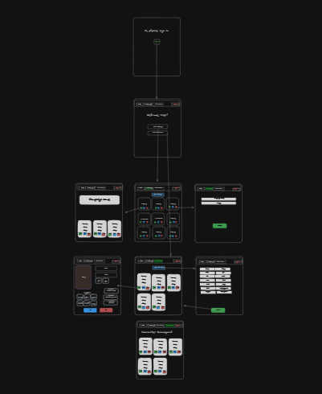

#DM Campaign Manager

DM Campaign Manager is a comprehensive tool designed for Dungeons and Dragons enthusiasts. This application allows Dungeon Masters and players to create and manage characters and campaigns, providing an organized and enriching gaming experience. With features like character creation, campaign organization, and status updates, DM Campaign Manager enhances the storytelling aspect of D&D gameplay.

#Wireframe: https://dbdiagram.io/d/Campaign-Manager-64f357bc02bd1c4a5eda08b8

#Data Flow Chart: 

#Intended Audience

DM Campaign Manager is perfect for D&D players and Dungeon Masters looking for a seamless way to track their campaigns, characters, and their evolving stories.

#Features

Character Management: Create characters with attributes like name, class, and hit points. Update their details as they progress through the campaign.
Campaign Organization: Group characters into campaigns, providing a clear view of who is involved in each storyline.
Status Update: Characters can be marked as alive or deceased, reflecting their current status in the campaign.
Two Main Views: Active Characters and Campaigns, allowing users to switch between different aspects of their D&D universe.
